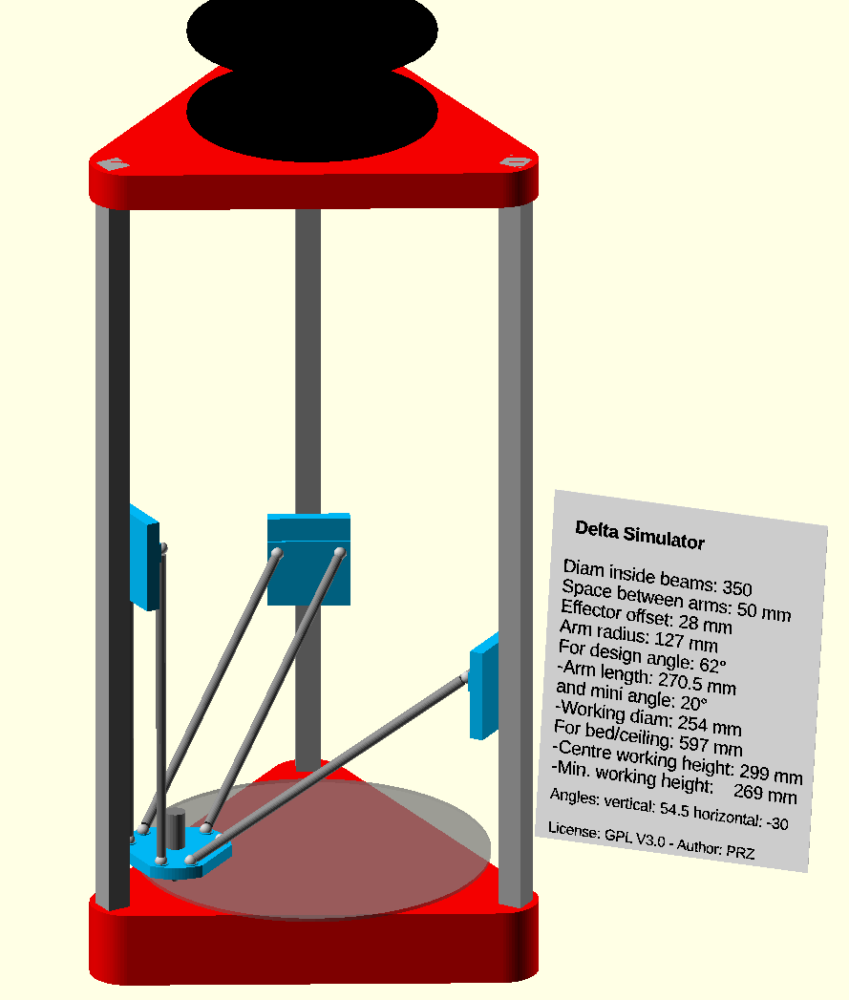

# OpenSCAD-Delta-Simulator
Simulate cinematic of a delta robot (3D printer or CNC) - animation 
Display parameters on screen 
dataset independant files for existing or projected printers 
Possibility to make a film 
 

predefined dataset for simulation of :
- Kossel
- Rostock max
- Fisher
- Tiko

and other printers
